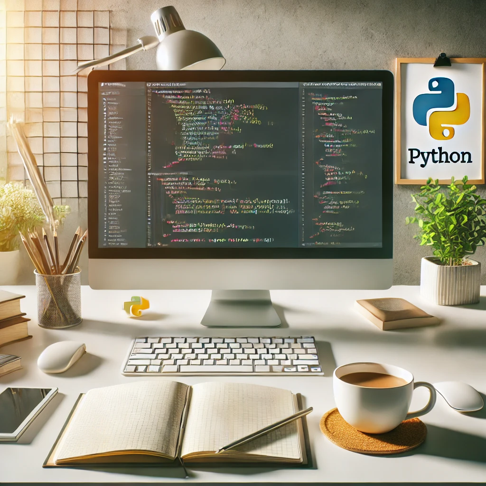

# مقدمة في لغة Python
الهدف من الكورس:
تقديم أساسيات لغة البرمجة بايثون بشكل واضح وعملي يناسب المبتدئين، مع بناء المهارات الأساسية للوصول إلى الاحتراف.
محتويات الكورس:

## الوحدة الأولى: مقدمة وتمهيد
### •	ما هي لغة Python؟
### •	لماذا تختار Python؟ (سهولتها، قوتها، واستخداماتها)
### •	تثبيت Python على أنظمة التشغيل (Windows)
### •	التعرف على بيئة التطوير IDE (PyCharm, VS Code, Jupyter Notebook)
## الوحدة الثانية: أساسيات البرمجة مع Python
### •	كتابة وتشغيل أول برنامج (Hello World)
### •	التعرف على المتغيرات (Variables)
### •	أنواع البيانات الأساسية (Strings, Integers, Floats, Booleans)
### •	العمليات الحسابية الأساسية (Arithmetic operations)
## الوحدة الثالثة: التحكم في سير البرنامج
### •	الجمل الشرطية (if, else, elif)
### •	الحلقات التكرارية (for, while)
### •	تطبيقات وتمارين عملية بسيطة
## الوحدة الرابعة: الدوال والبرمجة الوظيفية
### •	تعريف واستخدام الدوال (Functions)
### •	تمرير القيم وإرجاع النتائج
### •	نطاق المتغيرات (scope)
### •	تمارين وتطبيقات عملية
## الوحدة الخامسة: المكتبات الشائعة وكيفية استخدامها
### •	 NumPy للحسابات الرقمية والمصفوفات
### •	 Pandas لتحليل البيانات
### •	Matplotlib  للرسم البياني والتصور
### •	تطبيق عملي متكامل باستخدام هذه المكتبات
## الوحدة الخامسة: المشاريع والتطبيقات المتقدمة
### •	مقدمة إلى الذكاء الاصطناعي والتعلم الآلي (TensorFlow/PyTorch)
### •	بناء تطبيق ويب بسيط باستخدام Streamlit 
### •	استخدام Jupyter Notebook للعمل التفاعلي مع Python
## الوحدة السادسة: الممارسة والتطوير الذاتي
### •	نصائح حول البحث والتطوير الذاتي
### •	مصادر مفيدة للتعلم المستمر
### •	نصائح احترافية وطرق للمضي قدماً في البرمجة والتطوير
# التقييم:
## •	اختبارات قصيرة بعد كل وحدة
## •	مشروع ختامي بسيط لتطبيق المفاهيم المدروسة
هذا الكورس سيكون مثاليًا لمن يريد البدء بشكل منهجي واضح في تعلم بايثون والانطلاق نحو الاحترافية.
